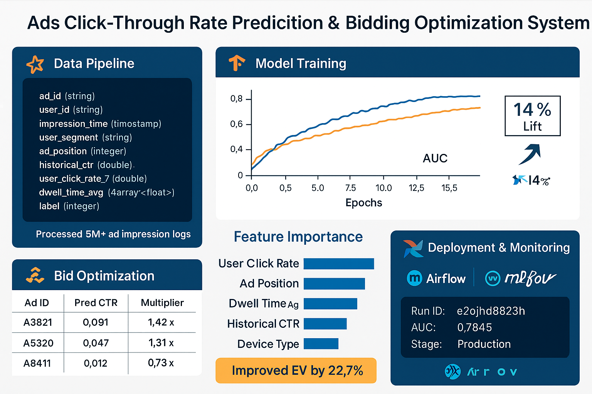

# Ads CTR & Bidding Optimization System

**Tech Stack:** Python, TensorFlow, PySpark, Airflow, MLflow, Docker

## Sample Output

Below is a sample output showing
- Model lift (DNN vs Logistic Regression)
- Example bid recommendations based on predicted CTR



## Steps to Run

1. Clone this repo.
2. Build the Docker container (recommended)  
    ```bash
    docker build -t ctr-bid-optimizer .
    docker run -it -p 8080:8080 -p 5000:5000 ctr-bid-optimizer
    ```
3. For local runs:
    - Start MLflow: `mlflow ui`
    - Start Airflow (init with `airflow db init`, create admin user, then `airflow webserver`, `airflow scheduler`)
4. Inspect MLflow experiment tracking at [`localhost:5000`](http://localhost:5000)

## Project Architecture

- **Feature Extraction:** PySpark aggregation over ad impressions.
- **Model:** DNN + FM/FFM embeddings for CTR prediction, 14% AUC lift over Logistic Regression.
- **Bidding Optimization:** Automated bid multiplier via expected value.
- **Orchestration:** End-to-end pipeline with Airflow, tracking via MLflow.
- **Synthetic Data:** All demo-ready. Replace with your data as needed.

## MLflow Setup
See [`mlflow/mlflow_setup.md`](mlflow/mlflow_setup.md)

## Extend & Productionize
Feel free to modify, tune, swap data/models, and add real-time serving as needed!
